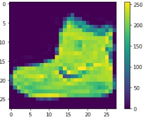

# Fashion mnist neural network.
Link to Google Colab: https://colab.research.google.com/drive/1ZfQObWxElodtrSK7tnXs265AReklAZ_V 
Link to neural network report: https://docs.google.com/document/d/1zshGKhwLwFHIes4PLYLj8oK0HblVvd3v-zyWRu365m8/edit?usp=sharing

## Description
This repository presents a Jupyter laptop demonstrating a convolutional neural network model that I built to classify images for the Fashion MNIST dataset.
This is a set of images consisting of a training set of 60,000 examples and a test set of 10,000 examples. Each example is a 28x28 grayscale image associated with a label from 10 classes.
Image pattern 
 

We were able to achieve accuracy of 0.91.
Here is a graph based on the training of a neural network: 

And yes. I'm from Russia. Therefore, report is in Russian.
